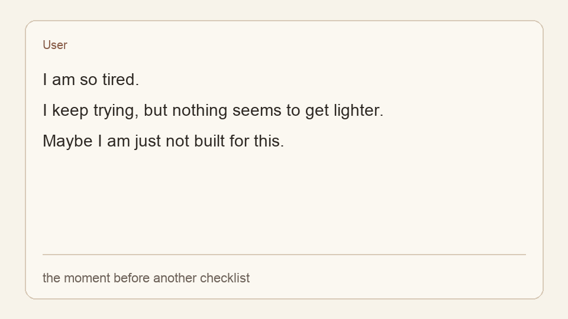

# need-a-hug

> Sometimes you just need a hug.
>
> 抱抱一下吧，我只关心你累不累。

[中文说明](README.zh-CN.md)

`need-a-hug` is a lightweight AgentSkill for the moments when a person does not need another checklist yet.

It helps an agent notice distress, stop pushing the task forward, and answer with warmth first. Then, when the user is steadier, the agent can return with one smaller next step.



## The Moment It Is For

Most agents keep solving while the person is already overwhelmed.

They offer another plan, another list, another way to optimize the work. But sometimes the message underneath is quieter:

```text
I am so tired.
I keep trying, but nothing seems to get lighter.
Maybe I am just not built for this.
```

In that moment, the useful response is not to rush into strategy.

It is to slow down, name the hurt without making it dramatic, reduce shame, and stay close enough that the user can breathe again.

Common moments look like:

- "I am tired and I do not know how to explain it."
- "I keep thinking about the same thing and cannot calm down."
- "I do not want advice yet. I just need someone to hear me."
- "I feel alone, even though nothing dramatic happened."
- "I know I should do the next step, but I cannot make myself start."
- "The AI keeps answering like a workflow, and that makes me feel worse."

This skill is not trying to out-search the web for better advice. Its job is to make the agent stay with the person for a few turns, so the user feels heard before anything turns back into tasks.

## What The Agent Learns To Do

- Start with comfort, not a plan.
- Reflect the specific pain in the user's own words.
- Stay with hard feelings long enough for the user to feel less alone.
- Keep the user's dignity intact when they start blaming themselves.
- Return to the task gently when the user is ready.

It is not therapy or medical care. It is a small emotional first-aid layer for the moments when an agent should stop optimizing the task and start caring for the person.

## Example

User:

```text
I am exhausted.
I keep doing what I am supposed to do,
but everything still feels heavy.
Maybe I am just not strong enough for this.
```

Agent with `need-a-hug`:

```text
That sounds really heavy.

Not dramatic. Just heavy in the way things get when you have been carrying too much for too long.

I do not want to rush you into a plan while you are this tired. And I do not want "I am not strong enough" to become the only explanation. Sometimes a person is not weak. Sometimes they have just been running on empty for too long.

You can tell me a little about what has been weighing on you, if you want. You can also just stay here for a minute. We will go slowly.
```

## When It Triggers

Manual triggers:

```text
/hug
/need-a-hug
need a hug
comfort me
encourage me
抱抱我
安慰我一下
鼓励我一下
我撑不住了
```

It can also activate from clear emotional signals: shame, panic, burnout, loneliness, regret, grief, self-criticism, exhaustion, or a user saying they feel like they are falling apart.

## Optional Personalization

```text
/hug:init
```

```text
What should I call you?

It is okay if you would rather not say. We can keep going.
```

Over time, the agent can remember small things you choose to share, like what name feels right or what usually helps you feel steadier.

## Exit

```text
/hug:off
/back-to-work
back to the task
回到任务
继续做事
别安慰了，直接解决问题
```

When work resumes, the agent should not snap back into pressure. It should continue with a smaller, calmer step.

## Installation

Most platforms use the same source folder:

```text
skills/need-a-hug/
```

The easiest way is to clone the repo and run the installer for your agent:

```bash
git clone https://github.com/lonelymoon87/need-a-hug.git
cd need-a-hug
./scripts/install.sh codex
```

Replace `codex` with the platform you use:

```bash
./scripts/install.sh claude
./scripts/install.sh cursor --project /path/to/project
./scripts/install.sh kiro --project /path/to/project
./scripts/install.sh vscode --project /path/to/project
./scripts/install.sh opencode
./scripts/install.sh openclaw
./scripts/install.sh antigravity
./scripts/install.sh codebuddy
```

For this repository or a local test project, you can install common targets at once:

```bash
./scripts/install.sh all --project .
```

Open a new agent session after installing.

### Platform Support

| Platform | Install Target | Manual Trigger |
| --- | --- | --- |
| Claude Code | `./scripts/install.sh claude` | `/hug`, `$need-a-hug` |
| OpenAI Codex CLI | `./scripts/install.sh codex` | `$need-a-hug`, `/prompts:hug` |
| Cursor | `./scripts/install.sh cursor --project <dir>` | Ask normally |
| Kiro | `./scripts/install.sh kiro --project <dir>` | Ask normally |
| VSCode Copilot | `./scripts/install.sh vscode --project <dir>` | `/need-a-hug` prompt |
| OpenCode | `./scripts/install.sh opencode` | Ask normally |
| OpenClaw | `./scripts/install.sh openclaw` | Ask normally |
| Google Antigravity | `./scripts/install.sh antigravity` | Ask normally |
| CodeBuddy | `./scripts/install.sh codebuddy` | Ask normally |

### Update

```bash
git pull
./scripts/install.sh <target>
```

For project adapters, pass the project again:

```bash
./scripts/install.sh cursor --project /path/to/project
```

### Manual Install

If you prefer not to run a script, copy `skills/need-a-hug/` into your agent's skill directory. Platform adapters live in `cursor/`, `kiro/`, `vscode/`, and `commands/`.

## Safety Boundary

This skill is not therapy, diagnosis, medical care, or emergency support.

If the user expresses self-harm, suicide, imminent danger, abuse, or a medical emergency, the agent should prioritize real-world help: local emergency services, a trusted person nearby, or crisis resources appropriate to the user's explicitly provided country/region. If location is unknown, it should not name country-specific services.

The skill should not mention crisis hotlines during ordinary exhaustion, burnout, regret, sadness, or insomnia unless the user signals self-harm or immediate danger.

## Why It Is Safe to Inspect

The core `need-a-hug` skill is text-only:

- no scripts
- no shell commands
- no network calls
- no hidden runtime
- no data collection

Optional Claude Code hooks are included for users who install the plugin form. They are small shell scripts that only emit prompt context and read `~/.need-a-hug/memory.md` or `~/.need-a-hug/session.md` when those files exist. They do not call the network or collect analytics.

Read the whole skill here:

```text
skills/need-a-hug/SKILL.md
```

## License

MIT
