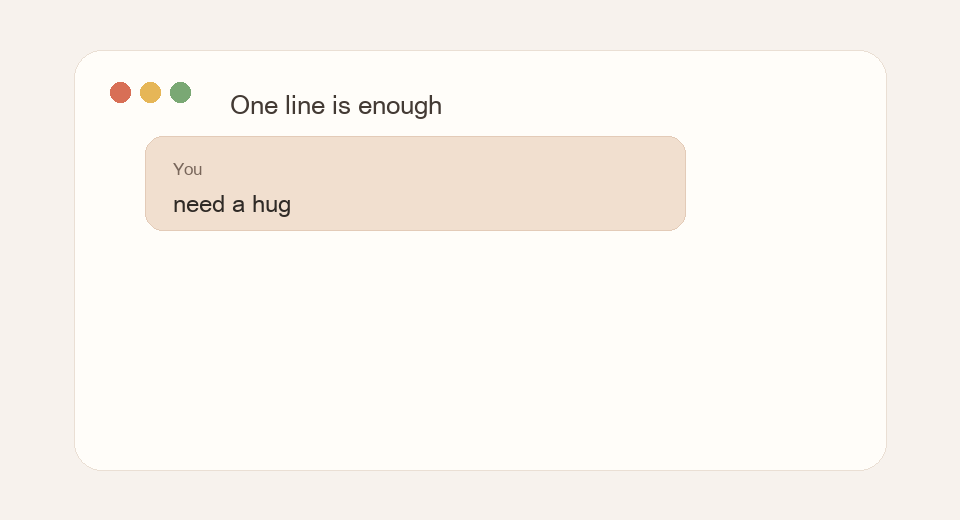
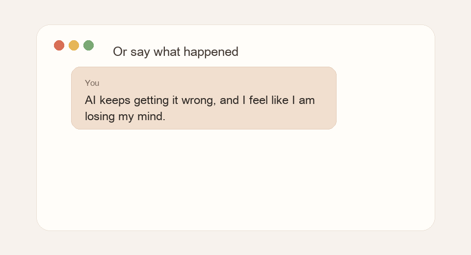

# need-a-hug

> Emotional first aid for coding agents when the human is already overloaded.

[](https://github.com/lonelymoon87/need-a-hug/releases/latest)
[](https://github.com/lonelymoon87/need-a-hug/stargazers)
[](LICENSE)

[中文说明](README.zh-CN.md) · [Download the `.skill`](https://github.com/lonelymoon87/need-a-hug/releases/latest/download/need-a-hug.skill) · [Claude Code plugin](https://github.com/lonelymoon87/need-a-hug/releases/latest/download/need-a-hug-claude-plugin.zip)

**Need a Hug** is an open-source Agent Skill / Claude Code plugin / Codex skill for AI coding assistants that should notice when the person using them is overwhelmed, burned out, ashamed, or just needs a gentler reply before continuing.

This is a slightly unusual skill.

Most skills teach an agent how to be faster, sharper, more capable, more useful.

This one asks the agent to notice whether you are tired.

Some moments are not ready to be solved yet.

You may be tired, ashamed, frustrated with an agent, or just done explaining. You may not need analysis yet. You may not need optimization or a plan.

You may just need the agent to stop pushing for a minute and answer like there is a person on the other side.

`need-a-hug` is a lightweight AgentSkill for those moments.

Whenever you want comfort, encouragement, or a small pause before returning to the work, just send:

```text
need a hug
```

You can also skip the trigger and simply say what happened.

<table>
  <tr>
    <td align="center"></td>
    <td align="center"></td>
  </tr>
  <tr>
    <td align="center">One line is enough</td>
    <td align="center">Or say what happened</td>
  </tr>
</table>

## The Moment It Is For

Most agents keep solving while the person is already overwhelmed.

They keep trying to move the task forward. That can be useful later, but sometimes it arrives too early.

This skill is for moments like:

```text
I am tired and I do not know how to explain it.
```

```text
This bug is destroying me.
```

```text
I do not want advice yet. I just need someone to hear me.
```

```text
The AI keeps answering like a workflow, and that makes me feel worse.
```

`need-a-hug` helps the agent slow down, name the hurt without making it dramatic, reduce shame, and stay close enough that the user can breathe again.

## What It Is Not

`need-a-hug` is intentionally smaller and safer than a therapy chatbot. It is a humane agent UX layer for coding assistants, not a mental-health product.

| Compared with | What they usually do | What `need-a-hug` does instead |
| --- | --- | --- |
| Therapy chatbot | Simulate ongoing counseling, mood tracking, screening, or treatment-like conversation | Offer short emotional first aid, then return gently to the user's actual work |
| Productivity coach | Convert distress into goals, routines, checklists, or habits | Pause the productivity pressure until the user is steadier |
| Generic system prompt | Add broad empathy instructions that are easy to ignore during tool-heavy work | Gives the agent concrete triggers, first-reply shape, crisis boundaries, and task-return rules |
| Normal coding agent | Keeps planning, editing, and explaining even when the human is overloaded | Stops pushing, lowers cognitive load, and resumes with one small verifiable step |

## The Agent Made It Worse

A special use case is when the assistant itself caused the overload:

```text
The agent changed too many files, tests are failing, and now I feel like I am losing control of the project.
```

In that moment, the right answer is not another large plan. The agent should acknowledge the frustration, stop broad edits, inspect what happened, and recover one small verified fact at a time.

```text
We both need to slow down for a second.

I will not keep changing files blindly. First I will look at the diff, identify the smallest broken piece, and verify one recovery step before touching anything else.
```

## What The Agent Learns To Do

- Start with comfort, not a plan.
- Reflect the specific pain in the user's own words.
- Stay with hard feelings long enough for the user to feel less alone.
- Keep the user's dignity intact when they start blaming themselves.
- Return to the task gently when the user is ready.

It is not therapy or medical care. It is a small emotional first-aid layer for the moments when an agent should stop optimizing the task and start caring for the person.

## Examples

You do not have to write a perfect prompt.

You can send one line:

```text
need a hug
```

The agent should comfort first, not immediately ask for background.

You can describe the problem directly:

```text
AI keeps getting it wrong, and I feel like I am losing my mind.
```

The agent should first acknowledge that this is frustrating, separate the tool failure from your worth, and then help you recover one small fact at a time.

You can also say more:

```text
I am exhausted.
I keep doing what I am supposed to do,
but everything still feels heavy.
Maybe I am just not strong enough for this.
```

The agent should help that sentence feel less final before turning it into a plan.

## When It Triggers

Manual triggers:

```text
/hug
/need-a-hug
need a hug
comfort me
encourage me
```

It can also activate from clear emotional signals: shame, panic, burnout, loneliness, regret, grief, self-criticism, exhaustion, or a user saying they feel like they are falling apart.

## Optional Personalization

```text
/hug:init
```

```text
What should I call you?

It is okay if you would rather not say. We can keep going.
```

Over time, the agent can remember small things you choose to share, like what name feels right or what usually helps you feel steadier.

## Exit

```text
/hug:off
/back-to-work
back to the task
```

When work resumes, the agent should not snap back into pressure. It should continue with a smaller, calmer step.

## Installation

Most platforms use the same source folder:

```text
skills/need-a-hug/
```

Clone the repo and run the installer:

```bash
git clone https://github.com/lonelymoon87/need-a-hug.git
cd need-a-hug
./scripts/install.sh
```

The installer asks which agent to set up. Open a new agent session after installing.

For agents that support drag-and-drop skill import, use the release asset named `need-a-hug.skill`. That asset contains only the portable core skill. It does not include Claude Code hooks or slash commands.

For Claude Code users who want the optional hooks and commands, install the plugin release asset `need-a-hug-claude-plugin.zip` or use the repo installer.

Release artifacts are built with:

```bash
./scripts/package-release.sh
```

The `.skill` asset is a zip whose root contains `SKILL.md`, `references/`, and `agents/`, matching the Agent Skills import shape.

### Advanced

Install directly for one target:

```bash
./scripts/install.sh codex
./scripts/install.sh claude
./scripts/install.sh cursor --project /path/to/project
./scripts/install.sh kiro --project /path/to/project
./scripts/install.sh vscode --project /path/to/project
./scripts/install.sh opencode
```

Supported targets: `codex`, `claude`, `cursor`, `kiro`, `vscode`, `opencode`, `openclaw`, `antigravity`, `codebuddy`, `all`.

### Update

```bash
git pull
./scripts/install.sh
```

### Manual Install

If you prefer not to run a script, copy `skills/need-a-hug/` into your agent's skill directory. Platform adapters live in `cursor/`, `kiro/`, `vscode/`, and `commands/`. Claude Code hooks live in `hooks/` and only apply when installed as a plugin or through the repo installer.

## Safety Boundary

This skill is not therapy, diagnosis, medical care, or emergency support.

If the user expresses self-harm, suicide, imminent danger, abuse, or a medical emergency, the agent should prioritize real-world help: local emergency services, a trusted person nearby, or crisis resources appropriate to the user's explicitly provided country/region. If location is unknown, it should not name country-specific services.

The skill should not mention crisis hotlines during ordinary exhaustion, burnout, regret, sadness, or insomnia unless the user signals self-harm or immediate danger.

## Why It Is Safe to Inspect

The core `need-a-hug` skill is text-only:

- no scripts
- no shell commands
- no network calls
- no hidden runtime
- no data collection

Optional Claude Code hooks are included for users who install the plugin form. They are small shell scripts that only emit prompt context and read `~/.need-a-hug/memory.md` or `~/.need-a-hug/session.md` when those files exist. They do not call the network or collect analytics.

Read the whole skill here:

```text
skills/need-a-hug/SKILL.md
```

## License

MIT
