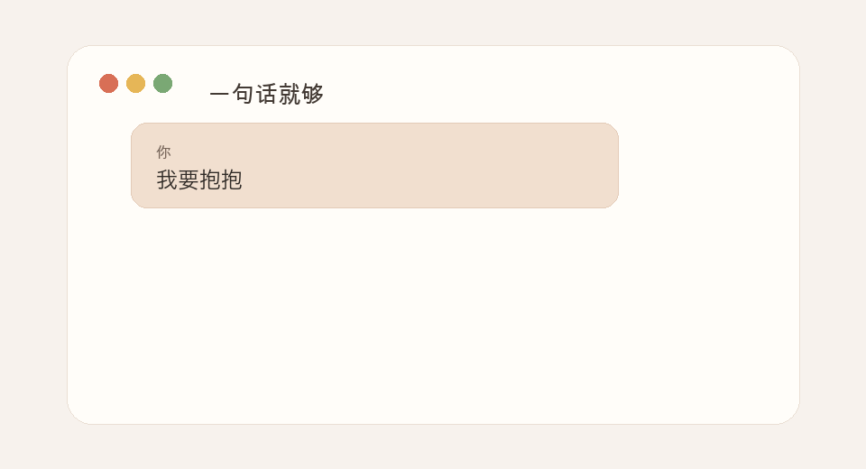
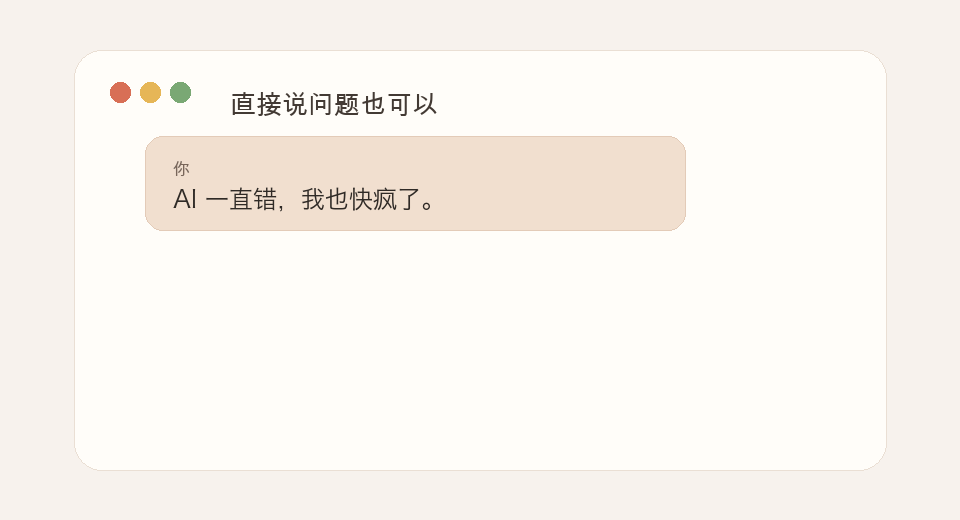

# need-a-hug

> 抱抱一下吧，我只关心你累不累。

这是一个有点特殊的 skill。

很多 skill 都在关心怎么让 Agent 更快、更强、更会解决问题。

只有这个 skill，会先关心你累不累。

你是否有过这样的时刻：

明明只是想修一个 bug，结果越修越怀疑自己。

明明只是想把事情做完，却突然累到一句话也不想说。

明明知道“应该继续”，但心里已经开始小声地说：我是不是不行。

也许你不需要另一个计划。

也许你不需要马上被分析、被拆解、被推回任务。

也许你只是想要一个很轻的停顿：有人先抱抱你，听你说一句，然后再陪你慢慢回来。

`need-a-hug` 就是为这种时刻准备的 AgentSkill。

无论什么时候，你想要一个拥抱、一点安慰、一句“先别急”，只要发：

```text
need a hug
```

或者：

```text
我要抱抱
```

你也可以什么触发词都不用，直接说你发生了什么。

<table>
  <tr>
    <td align="center"></td>
    <td align="center"></td>
  </tr>
  <tr>
    <td align="center">一句话就够</td>
    <td align="center">直接说问题也可以</td>
  </tr>
</table>

## 它适合的时刻

很多 Agent 在你已经很难受的时候，仍然会继续输出：

- 下一步计划
- 检查清单
- 执行建议
- “你可以试试...”
- “我们来分析一下...”

这些东西不是没有用，只是有时候太早了。

当你已经很累、很自责、很委屈，或者被 AI 工具反复出错弄到崩溃时，马上继续推进只会更像压力。这个 skill 会提醒 Agent：先看见人，再处理事。

你可以只说：

```text
我好累。
```

也可以说：

```text
这个 bug 把我搞崩了。
```

也可以只是：

```text
抱抱我。
```

`need-a-hug` 不要求你解释完整，不要求你把情绪整理好，也不要求你先证明自己“真的值得被安慰”。

## 它会让 Agent 怎么变

- 先安慰，不急着给方案
- 听出你真正难受的地方
- 在你开始怪自己的时候，帮你把那句话放轻一点
- 多陪你几轮，而不是马上把你推回任务里
- 等你缓过来，再一起看一个很小的下一步

它不是心理咨询，也不能替代专业帮助。它只是一个很小的情绪急救层：当 Agent 应该先关心人，而不是继续优化任务时，它提醒 Agent 慢下来。

## 示例

你不需要写得很完整。

你可以只发一句：

```text
need a hug
```

Agent 会先停下来安慰你，而不是立刻追问背景。

你也可以直接说：

```text
AI 一直错，我也快疯了。
```

Agent 应该先承认这真的很烦，帮你把“工具一直错”这件事和“我是不是很差”分开，然后再陪你确认一个事实、看一个很小的下一步。

你也可以慢慢说：

```text
我最近真的很累。
明明也在努力，工作和生活却都没有明显变好。
有时候会觉得，是不是我就是不够好。
```

Agent 应该先让这句话不要继续压着你，而不是马上把它变成复盘、计划或行动项。

## 怎么触发

手动触发：

```text
/hug
/need-a-hug
need a hug
comfort me
encourage me
我要抱抱
抱抱我
安慰我一下
鼓励我一下
我撑不住了
```

它也会尽量感知明显的情绪信号，比如自责、崩溃、孤独、后悔、长期疲惫、很强的比较感，或者你说自己快撑不住了。

## 可选初始化

```text
/hug:init
```

```text
以后我可以怎么称呼你？

不想说也没关系，我们直接继续。
```

以后如果你愿意，它也可以记住一些很小的偏好，比如你喜欢别人怎么称呼你，或者什么样的话会让你稍微稳一点。

## 退出

```text
/hug:off
/back-to-work
回到任务
继续做事
别安慰了，直接解决问题
```

回到任务以后，Agent 也不应该突然恢复成高压推进。它应该继续小一点、慢一点、稳一点。

## 安装

大多数平台使用同一个核心目录：

```text
skills/need-a-hug/
```

Clone 仓库，然后运行安装脚本：

```bash
git clone https://github.com/lonelymoon87/need-a-hug.git
cd need-a-hug
./scripts/install.sh
```

安装脚本会询问你要安装到哪个 Agent。安装后重新打开一个 Agent 会话。

如果你的 Agent 支持拖拽导入 skill，请使用 release asset 里的 `need-a-hug.skill`。这个文件只包含可移植的核心 skill，不包含 Claude Code hooks 或 slash commands。

如果你使用 Claude Code，并且想启用可选 hooks 和 commands，请使用 `need-a-hug-claude-plugin.zip` 这个 plugin 产物，或使用本仓库的安装脚本。

Release 产物用这个脚本生成：

```bash
./scripts/package-release.sh
```

其中 `.skill` 本质是一个 zip，根目录直接包含 `SKILL.md`、`references/` 和 `agents/`，符合 Agent Skills 的拖拽导入结构。

### 高级用法

也可以直接指定平台：

```bash
./scripts/install.sh codex
./scripts/install.sh claude
./scripts/install.sh cursor --project /path/to/project
./scripts/install.sh kiro --project /path/to/project
./scripts/install.sh vscode --project /path/to/project
./scripts/install.sh opencode
```

支持的 target：`codex`、`claude`、`cursor`、`kiro`、`vscode`、`opencode`、`openclaw`、`antigravity`、`codebuddy`、`all`。

### 更新

```bash
git pull
./scripts/install.sh
```

### 手动安装

如果不想运行脚本，把 `skills/need-a-hug/` 复制到对应工具的 skills 目录即可。Cursor、Kiro、VSCode 和 Codex prompt 的适配文件分别在 `cursor/`、`kiro/`、`vscode/` 和 `commands/`。Claude Code hooks 在 `hooks/` 里，只有通过 plugin 或仓库安装脚本安装时才会生效。

## 设计原则

第一句可以像一个拥抱：

```text
🫂 先抱抱你。
```

但不要每轮都重复。后面应该像一个人真的在听你说话。

默认先安慰，不要一上来就把选择丢给你：

```text
你想要安慰还是建议？
```

你已经很累了，这种问题也会变成压力。更好的方式是：

```text
我们先不急着做决定。等你缓一点，如果你愿意，我们再一起看下一步。
```

如果刚才是 Agent 把事情搞乱了，回到任务以后，它也要换一种做事方式：少改一点，先确认一点，做完验证一点。不要一边安慰你，一边继续把事情搞得更乱。

## 安全边界

这个工具不是治疗、诊断、医疗建议，也不是紧急服务。

如果你提到自伤、自杀、正在发生的危险、虐待或医疗紧急情况，Agent 会优先建议你联系现实中的帮助：当地紧急服务、身边可信任的人，或者在你明确提供所在地后，给出当地合适的求助资源。

普通的疲惫、后悔、难过、失眠，不应该突然搬出危机热线。除非你明确说到自伤、自杀或正在发生的危险。

## 为什么可以放心检查

核心 `need-a-hug` 是纯文本：

- 没有脚本
- 不执行命令
- 不联网
- 不收集数据
- 不读隐私文件

Claude Code 插件额外带了几组可选钩子。它们是很小的 shell 脚本，只给 Agent 补一点提示上下文；只有在 `~/.need-a-hug/memory.md` 或 `~/.need-a-hug/session.md` 已经存在时，才会读取这两个文件。它们不联网，也不做统计。

你可以直接读完整内容：

```text
skills/need-a-hug/SKILL.md
```

## License

MIT
